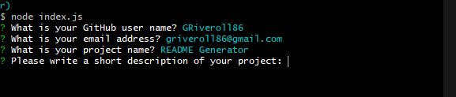
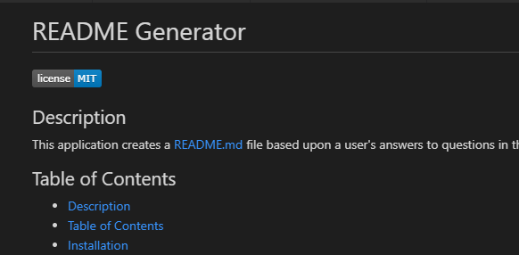

## README Generator
[Demonstration Video](https://watch.screencastify.com/v/STAptEMwJdnzJlAXkvBo)

To begin, users should fork this repository and pull. 

This assignment asked us to create a README generator using node.js and the inquirer module. Once this repository has been forked and pulled, open the terminal, navigate to the folder 'main', install node and its dependencies using:
```bash
npm install
```
in the command line of your terminal.
Once installed, using:
```bash
node index.js
```
will run the application. Users answer questions in the command line and a README.md file based upon those answers will be created.

## Preview Images





## Primary Technologies Used
* Javascript
* Node.js
* Inquirer module

